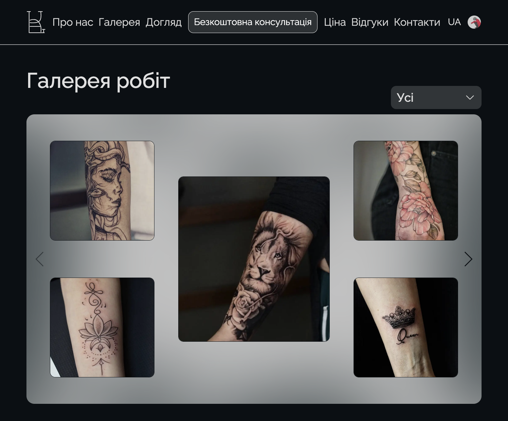

# Katerina Tattoo Art



## Description

Tattoo salon website. On the website you can view our work, sign up for a session, leave your review, get advice. Status: in development.

## Tech Stack

React, Next.js, Tailwind CSS, Supabase, Jet Admin

[Figma](https://www.figma.com/file/km20jOEyZ6lbIpzXfNDWhq/Katerina-Tattooart?node-id=175%3A2872&mode=dev)

# Features

- ???

## Environment Variables

To run this project, you will need to add the following environment variables to your `.env.local` file:

`NEXT_PUBLIC_SUPABASE_URL`

`NEXT_PUBLIC_SUPABASE_ANON_KEY`

## Demo

https://katerina-tattooart.vercel.app/

## Run Locally

Clone the project

```bash
git clone https://github.com/zim89/katerina-tattooart.git
```

Go to the project directory

```bash
cd katerina-tattooart
```

Install dependencies

```bash
yarn install
```

Start the server

```bash
yarn dev
```
Open [http://localhost:3000](http://localhost:3000) with your browser to see the result.


## Links
[Admin panel](https://tattooart.jetadmin.io/app/tattooart/)

[Admin builder](https://tattooart.jetadmin.io/builder/tattooart)

[GitHub](https://github.com/zim89/katerina-tattooart)

[Live demo](https://katerina-tattooart.vercel.app/)

[Figma](https://www.figma.com/file/km20jOEyZ6lbIpzXfNDWhq/Katerina-Tattooart?node-id=175%3A2872&mode=dev)